# Architecture Documentation

This document provides a comprehensive overview of the Interview App's architecture, system design, and technical decisions.

## Table of Contents

- [System Overview](#system-overview)
- [High-Level Architecture](#high-level-architecture)
- [Component Architecture](#component-architecture)
- [Data Flow](#data-flow)
- [Database Design](#database-design)
- [Communication Patterns](#communication-patterns)
- [Security Model](#security-model)
- [Technology Stack](#technology-stack)
- [Design Decisions](#design-decisions)

## System Overview

The Interview App is a cross-platform desktop application built using modern web technologies and Electron. It provides AI-powered mock interview practice with audio recording, evaluation, and progress tracking capabilities.

### Key Characteristics

- **Monorepo Architecture**: Nx-managed workspace with multiple applications
- **Desktop-First**: Electron wrapper with native OS integration
- **Microservices Pattern**: Separated API and Evaluator services
- **Local-First**: SQLite database with potential for cloud sync
- **Type-Safe**: Full TypeScript implementation across all layers

## High-Level Architecture

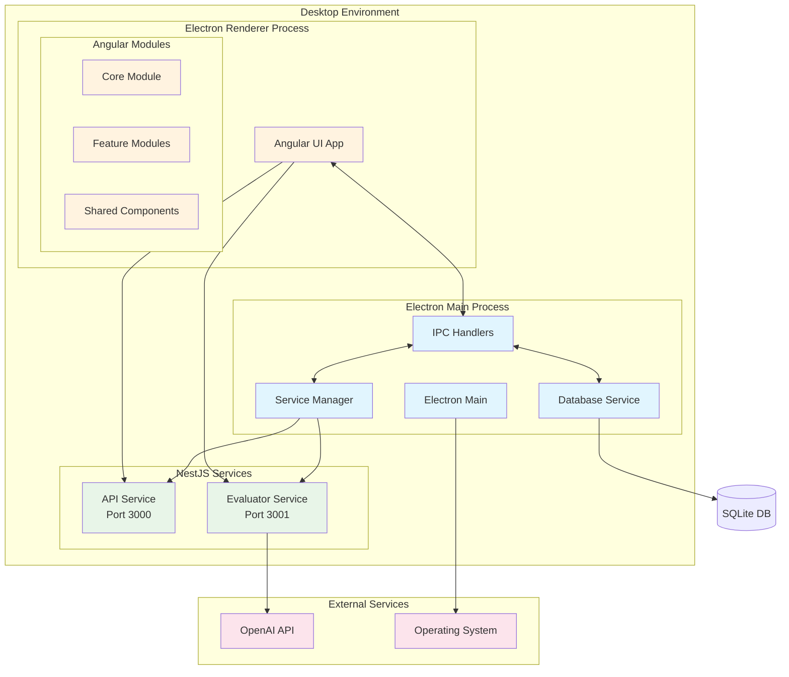

## Component Architecture

### Frontend Architecture (Angular 20)

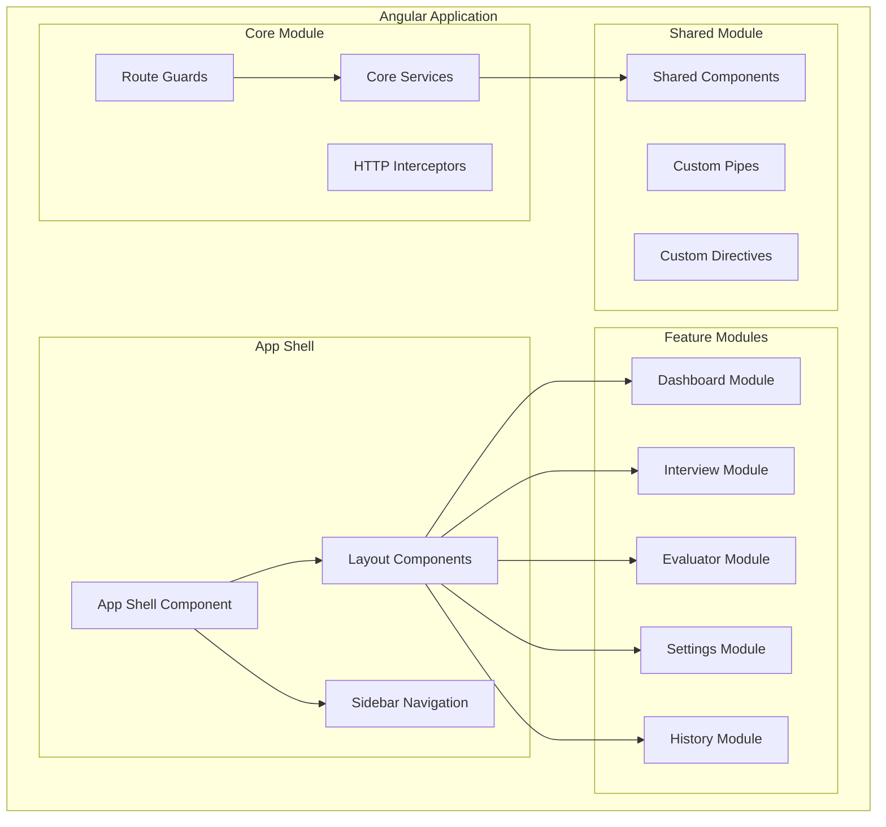

### Backend Architecture (NestJS Services)

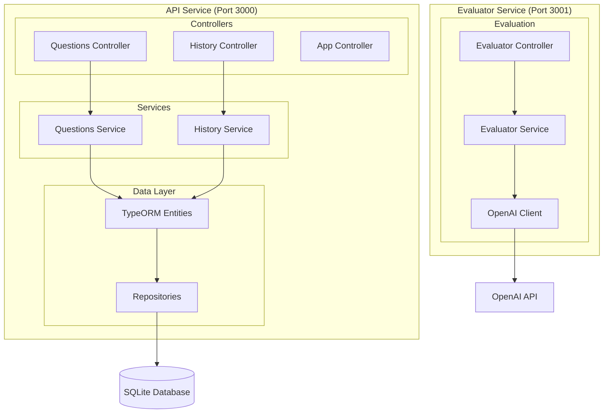

### Electron Architecture

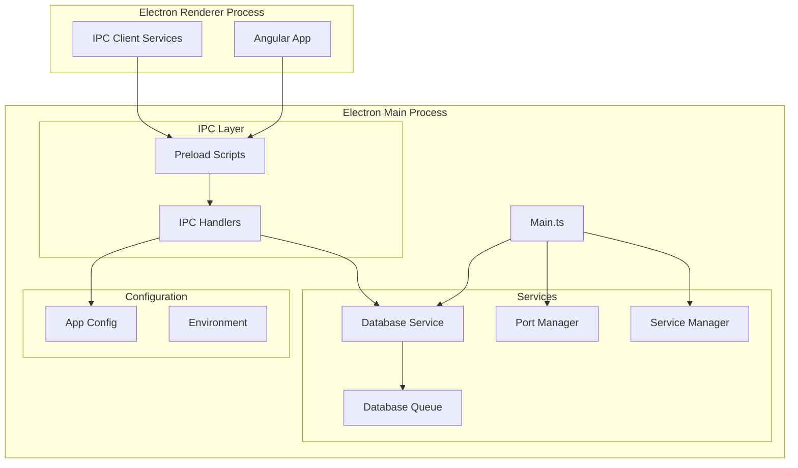

## Data Flow

### Interview Session Flow

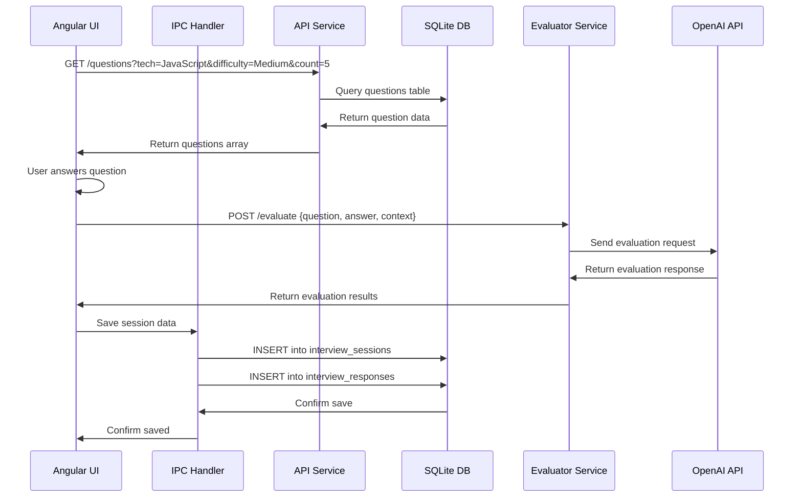

### Service Startup Flow

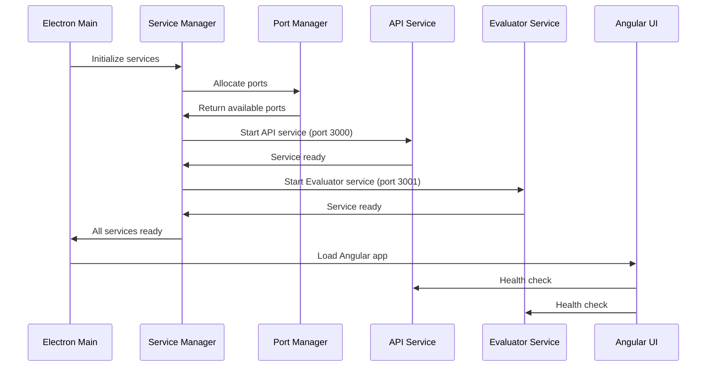

## Database Design

### Entity Relationship Diagram

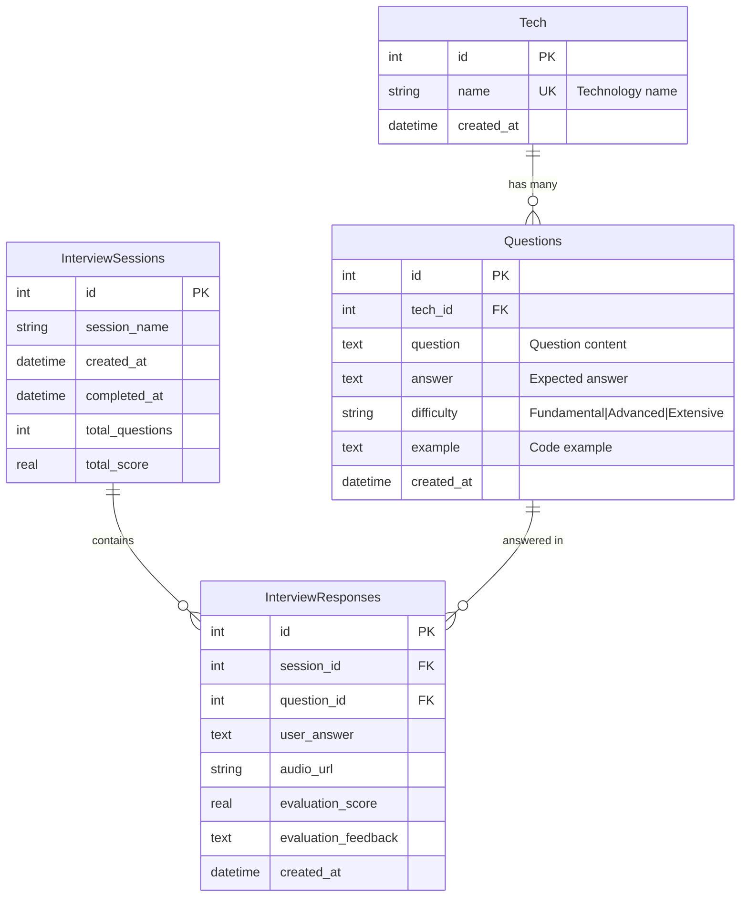

### Database Statistics

- **Technologies**: 15 total (JavaScript, Python, React, Angular, etc.)
- **Questions**: 3,844 total across all technologies
- **Difficulty Distribution**: 
  - Fundamental: ~40%
  - Advanced: ~45% 
  - Extensive: ~15%

### Table Schemas

#### Tech Table
```sql
CREATE TABLE tech (
  id INTEGER PRIMARY KEY AUTOINCREMENT,
  name TEXT UNIQUE NOT NULL,
  created_at DATETIME DEFAULT CURRENT_TIMESTAMP
);
```

#### Questions Table
```sql
CREATE TABLE questions (
  id INTEGER PRIMARY KEY AUTOINCREMENT,
  tech_id INTEGER NOT NULL,
  question TEXT NOT NULL,
  answer TEXT,
  difficulty TEXT DEFAULT 'Fundamental',
  example TEXT,
  created_at DATETIME DEFAULT CURRENT_TIMESTAMP,
  FOREIGN KEY (tech_id) REFERENCES tech(id)
);
```

#### Interview Sessions Table
```sql
CREATE TABLE interview_sessions (
  id INTEGER PRIMARY KEY AUTOINCREMENT,
  session_name TEXT,
  created_at DATETIME DEFAULT CURRENT_TIMESTAMP,
  completed_at DATETIME,
  total_questions INTEGER DEFAULT 0,
  total_score REAL DEFAULT 0
);
```

#### Interview Responses Table
```sql
CREATE TABLE interview_responses (
  id INTEGER PRIMARY KEY AUTOINCREMENT,
  session_id INTEGER NOT NULL,
  question_id INTEGER NOT NULL,
  user_answer TEXT,
  audio_url TEXT,
  evaluation_score REAL,
  evaluation_feedback TEXT,
  created_at DATETIME DEFAULT CURRENT_TIMESTAMP,
  FOREIGN KEY (session_id) REFERENCES interview_sessions(id),
  FOREIGN KEY (question_id) REFERENCES questions(id)
);
```

## Communication Patterns

### IPC Communication

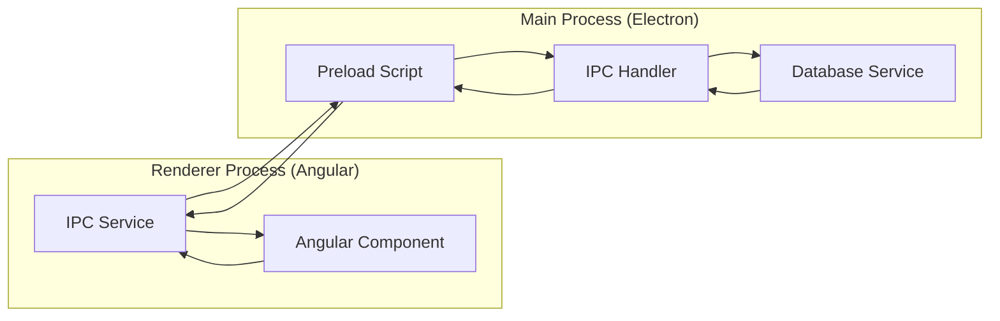

### HTTP Communication

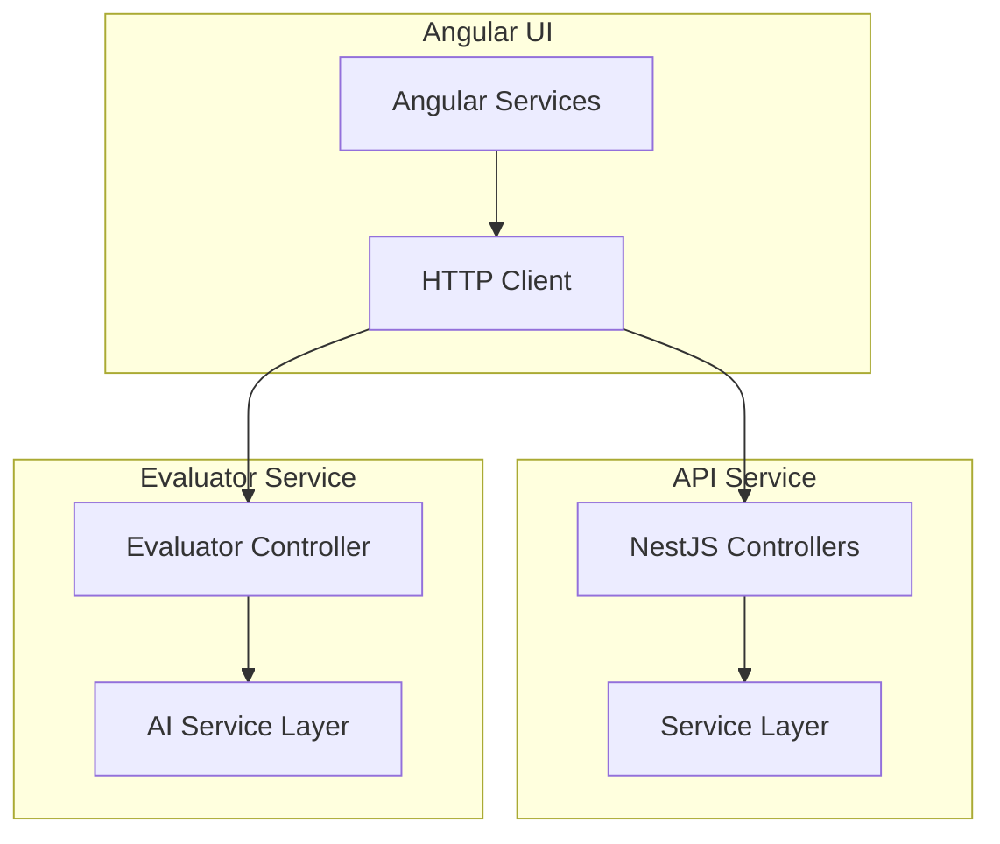

## Security Model

### Electron Security

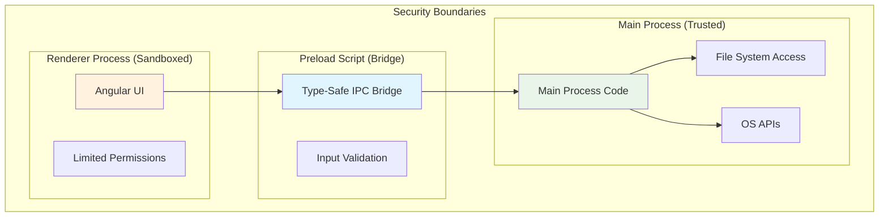

### Security Features

- **Context Isolation**: Enabled by default
- **Node Integration**: Disabled in renderer process
- **CSP Headers**: Content Security Policy implemented
- **Type-Safe IPC**: All IPC communication is strongly typed
- **Input Validation**: All user inputs validated before processing
- **API Key Management**: OpenAI keys stored securely, never logged

## Technology Stack

### Frontend Stack

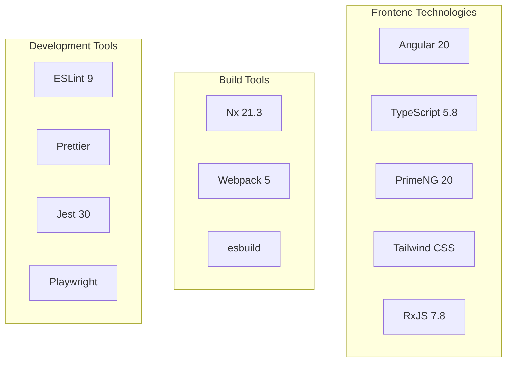

### Backend Stack

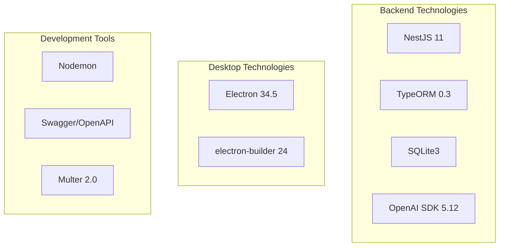

## Design Decisions

### Architecture Decisions

#### 1. Monorepo with Nx
**Decision**: Use Nx monorepo for managing multiple applications
**Rationale**: 
- Shared code and interfaces
- Consistent build and test processes
- Dependency management across services
- Better developer experience

#### 2. Electron Desktop Wrapper
**Decision**: Use Electron instead of native apps
**Rationale**:
- Cross-platform compatibility
- Leverage web technologies
- Rapid development and deployment
- Rich ecosystem and community

#### 3. Microservices Pattern
**Decision**: Separate API and Evaluator services
**Rationale**:
- Separation of concerns
- Independent scaling
- Different resource requirements (AI vs. CRUD)
- Better testing and maintenance

#### 4. SQLite for Data Storage
**Decision**: Use SQLite instead of cloud database
**Rationale**:
- Local-first approach
- No external dependencies
- Fast query performance
- Easy backup and migration

### Technical Decisions

#### 1. Angular 20 with Standalone Components
**Decision**: Use latest Angular with standalone architecture
**Rationale**:
- Modern development patterns
- Better tree-shaking
- Simplified module structure
- Signals for reactive state management

#### 2. PrimeNG for UI Components
**Decision**: Use PrimeNG instead of Material or custom components
**Rationale**:
- Rich component library
- Professional appearance
- Good Angular integration
- Excellent documentation

#### 3. TypeScript Throughout
**Decision**: Full TypeScript implementation
**Rationale**:
- Type safety across all layers
- Better developer experience
- Reduced runtime errors
- Enhanced IDE support

#### 4. IPC for Electron Communication
**Decision**: Use IPC instead of remote module
**Rationale**:
- Better security (context isolation)
- More explicit communication
- Type-safe contracts
- Future-proof architecture

### Performance Decisions

#### 1. OnPush Change Detection
**Decision**: Use OnPush strategy for all components
**Rationale**:
- Better performance
- Predictable update cycles
- Works well with signals
- Reduces unnecessary renders

#### 2. Lazy Loading Feature Modules
**Decision**: Implement lazy loading for feature modules
**Rationale**:
- Faster initial load time
- Better memory usage
- Modular architecture
- Progressive enhancement

#### 3. Database Query Optimization
**Decision**: Implement query caching and indexing
**Rationale**:
- Faster question retrieval
- Better user experience
- Reduced database load
- Scalable architecture

### Security Decisions

#### 1. Context Isolation in Electron
**Decision**: Enable context isolation and disable node integration
**Rationale**:
- Enhanced security
- Prevent code injection
- Better isolation between processes
- Industry best practices

#### 2. API Key Management
**Decision**: Store API keys in secure local storage
**Rationale**:
- User controls their keys
- No server-side key management
- Better privacy
- Compliance with OpenAI terms

## Future Architecture Considerations

### Potential Enhancements

1. **Cloud Sync**: Add PostgreSQL backend with cloud synchronization
2. **Microservices**: Further split services for better scalability
3. **Real-time Features**: WebSocket support for collaborative features
4. **Mobile Support**: React Native or PWA for mobile devices
5. **Analytics**: Advanced performance analytics and insights

### Scalability Considerations

- **Database Migration**: SQLite to PostgreSQL for cloud deployment
- **Service Discovery**: Implement service registry for microservices
- **Load Balancing**: Horizontal scaling for AI evaluation service
- **Caching Strategy**: Redis for session and query caching
- **CDN Integration**: Asset delivery optimization